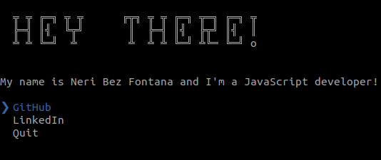

# nbfontana

> The Neri Bez Fontana CLI



## Usage

Install Node.js, then:

```
$ npm i -g nbfontana
$ npx nbfontana
```

## Built with

- [ink](https://github.com/vadimdemedes/ink) - React for interactive command-line apps

## Inspired by

[The Sindre Sorhus CLI](https://github.com/sindresorhus/sindresorhus)

## License

MIT © Neri Bez Fontana :shipit:
